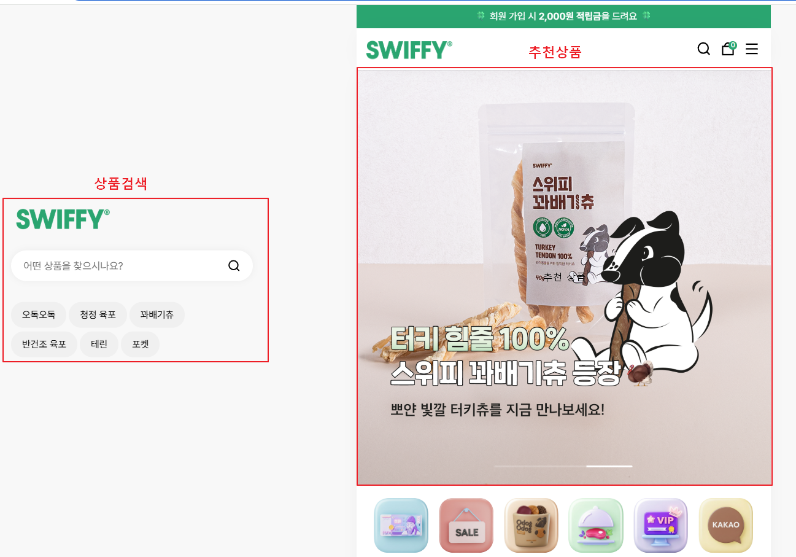
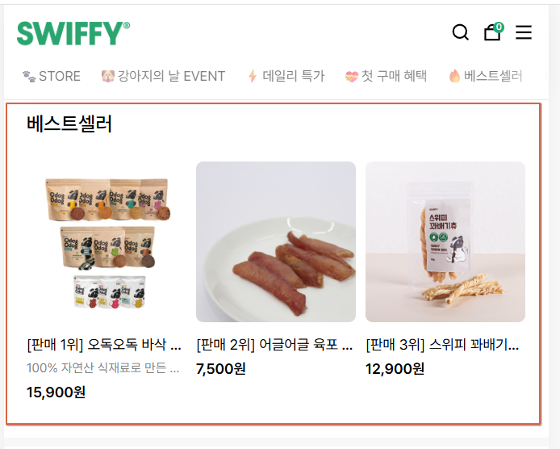
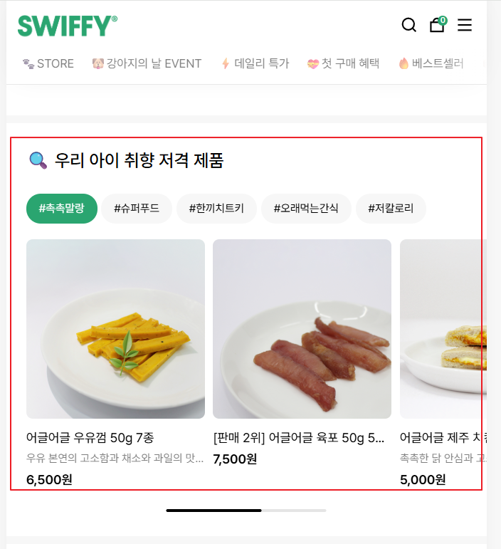
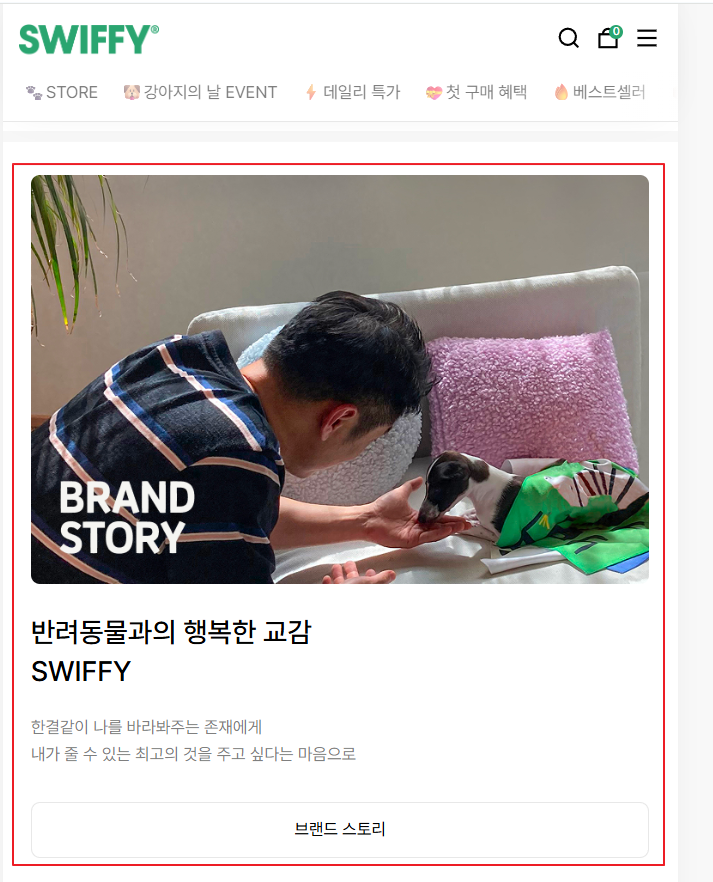
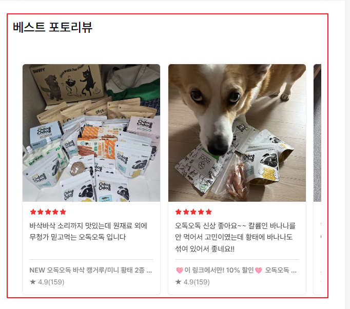
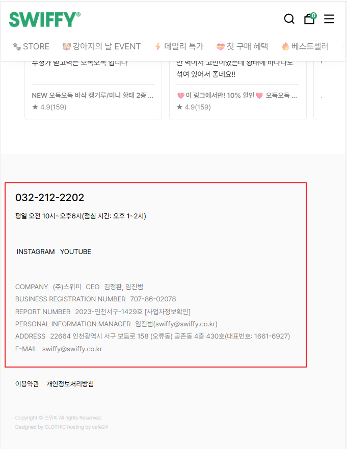

# 필요시 협의 내용들
# 






=======

## 지금은 사용자에게 렌더링하는 페이지

### 2\. 엔드포인트 상세 (Example)

### `GET` /api/v1/main

사용자의 상세 정보를 조회합니다.

#### **Request Parameters**

| Name | Type | Required | Description |
| :--- | :--- | :---: | :--- |
| ImageUrl | - | - | - |

#### **Request Body**
```json
{
  
}
```


#### **Success Response**

  * **Code:** 200 OK
  * **Content:**

<!-- end list -->

```json
{
  "status": "success",
  "data": {
    "id": 1,
    "username": "gemini_user",
    "email": "hello@gemini.ai",
    "created_at": "2026-04-02T09:00:00Z"
  }
}
```

#### **Error Response**

  * **Code:** 404 NOT FOUND
  * **Content:** `{ "message": "User not found" }`
  * **Code:** 401 UNAUTHORIZED
  * **Content:** `{ "message": "Invalid token" }`

-----


### 1\. API 개요 (선택 사항)


사용자의 상세 정보를 조회합니다.

#### **Request Parameters**

| Name | Type | Required | Description |
| :--- | :--- | :---: | :--- |
| `id` | `Integer` | ✅ | 사용자의 고유 ID (Path Variable) |
| `include_posts` | `Boolean` | ❌ | 작성한 포스트 포함 여부 (Query Param) |

#### **Success Response**

  * **Code:** 200 OK
  * **Content:**

<!-- end list -->

```json
{
  {
    "id": "success",
    "title":
    "image url":
    "content":
    "price":
  }

 {
    "id": "success",
    "title":
    "image url":
    "content":
    "price":
  }
{
    "id": "success",
    "title":
    "image url":
    "content":
    "price":
  }
}
```

#### **Error Response**

  * **Code:** 404 NOT FOUND
  * **Content:** `{ "message": "User not found" }`
  * **Code:** 401 UNAUTHORIZED
  * **Content:** `{ "message": "Invalid token" }`

-----
#### 참고사항
베스트셀러는 [전체판매1위] 이런 템플릿으로 하고 
태그는 [판매1위] 이런식으로 템플릿을 합니다.


### 1\. API 개요 (선택 사항)

> **Base URL:** `https://api.example.com/api/v1`  
> **Authentication:** JWT Access/Refresh token (Cookie 헤더)

-----

사용자의 상세 정보를 조회합니다.

#### **Request Parameters**

| Name | Type | Required | Description |
| :--- | :--- | :---: | :--- |
| - | - | - | - |

#### **Request Body**
```json
{
  "id" : ,
  "title" : "",
  "contnet" : "",
  제품으로 들어가는 Url : "",
  "price" : ,
  "태그" : ""
}
```


#### **Success Response**

  * **Code:** 200 OK
  * **Content:**

<!-- end list -->

```json
{
  {
    "id": "success",
    "title":
    "image url":
    "content":
    "price":
  }

 {
    "id": "success",
    "title":
    "image url":
    "content":
    "price":
  }
{
    "id": "success",
    "title":
    "image url":
    "content":
    "price":
  }
{
    "id": "success",
    "title":
    "image url":
    "content":
    "price":
  }
{
    "id": "success",
    "title":
    "image url":
    "content":
    "price":
  }
}
```

#### **Error Response**

  * **Code:** 404 NOT FOUND
  * **Content:** `{ "message": "User not found" }`
  * **Code:** 401 UNAUTHORIZED
  * **Content:** `{ "message": "Invalid token" }`

#### 참고사항

* 태그 최대 개수는 5개 
* 태그 별제품은 최대 5개
* 랜더링되는 제품은 (태그별)판매량순(판매량 정보도 백엔드에서 던져주는 것으로)
* 

-----


-----

사용자의 상세 정보를 조회합니다.

#### **Request Parameters**

| Name | Type | Required | Description |
| :--- | :--- | :---: | :--- |
| `id` | `Integer` | ✅ | 사용자의 고유 ID (Path Variable) |
| `include_posts` | `Boolean` | ❌ | 작성한 포스트 포함 여부 (Query Param) |

#### **Success Response**

  * **Code:** 200 OK
  * **Content:**

<!-- end list -->

```json
{
  "status": "success",
  "data": {
    "Id" : ,
    "title": "",
    "mainIamgeUrl": "",
    "content": "",
    "contentImageUrl": ""
  }
}
```

#### **Error Response**

  * **Code:** 404 NOT FOUND
  * **Content:** `{ "message": "User not found" }`
  * **Code:** 401 UNAUTHORIZED
  * **Content:** `{ "message": "Invalid token" }`


#### 참고사항

*
* 
-----


-----

사용자의 상세 정보를 조회합니다.

#### **Request Parameters**

| Name | Type | Required | Description |
| :--- | :--- | :---: | :--- |
| `id` | `Integer` | ✅ | 사용자의 고유 ID (Path Variable) |
| `include_posts` | `Boolean` | ❌ | 작성한 포스트 포함 여부 (Query Param) |

#### **Success Response**

  * **Code:** 200 OK
  * **Content:**

<!-- end list -->

```json
{
  "status": "success",
  "data": {
    "Id" : ,
    "title": "",
    "mainIamgeUrl": "",
    "content": "",
    "contentImageUrl": ""
  }
}
```

#### **Error Response**

  * **Code:** 404 NOT FOUND
  * **Content:** `{ "message": "User not found" }`
  * **Code:** 401 UNAUTHORIZED
  * **Content:** `{ "message": "Invalid token" }`


#### 참고사항


-----

사용자의 상세 정보를 조회합니다.

#### **Request Parameters**

| Name | Type | Required | Description |
| :--- | :--- | :---: | :--- |
| `id` | `Integer` | ✅ | 사용자의 고유 ID (Path Variable) |
| `include_posts` | `Boolean` | ❌ | 작성한 포스트 포함 여부 (Query Param) |

#### **Success Response**

  * **Code:** 200 OK
  * **Content:**

<!-- end list -->

```json
{
  "status": "success",
  "data": {
    "Id" : ,
    "title": "",
    "firstreviewIamgeUrl": "",
    "star": "",
    "content": "",
    "평균" : "",
    "리뷰개수" : ,
  }
{
  "status": "success",
  "data": {
    "Id" : ,
    "title": "",
    "firstreviewIamgeUrl": "",
    "star": "",
    "content": "",
    "평균" : "",
    "리뷰개수" : ,
    "구매자이름" : "",
    "좋아요 개수" : "",
    "댓글" : "",
    "작성일자" : "",
    "기호도" : "",
    "재구매의사" : [있어요, 없어요],
    "리뷰보여주는 Url" : ""
  }
}
```

#### **Error Response**

  * **Code:** 404 NOT FOUND
  * **Content:** `{ "message": "User not found" }`
  * **Code:** 401 UNAUTHORIZED
  * **Content:** `{ "message": "Invalid token" }`


#### 참고사항

#### 최상단 인기 검색어 
* 인기 검색어 키워드 5개 고정
* 인기 검색어 이외에 사용자 검색 키워드 필터정책 차후 정의
* 백엔드에서 인기 검색어 키워드 제공
* 인기 검색어 눌렀을 때 들어갈 Url


