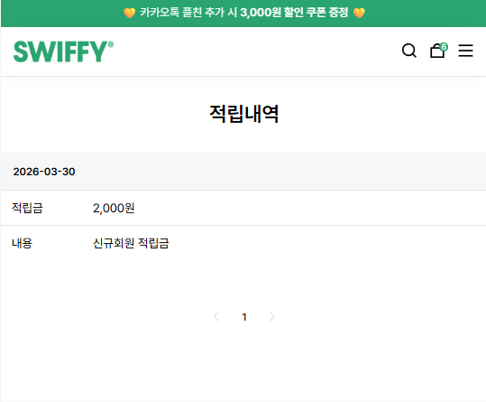
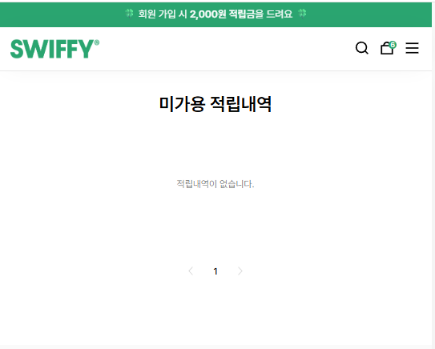
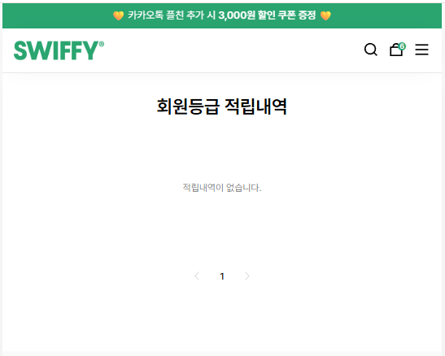
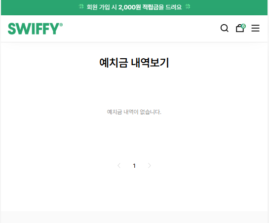

## 회의 내용

| 데이터 | 값  |
| ------ | --- |
| 이름   | ... |


```
적립금
등급
쿠폰 개수
주문내역
최근주문내역(입금전 / 배송준비중 / 배송중 / 배송완료 / 취소 / 교환 / 반품)
```
Res
```
상태 
기간 (오늘 / 1개월 / 3개월 / 6개월 )

```
  


```
기간별 상품주문내역
상품 주문 날짜
주문번호
이미지
타이틀
가격
수량
옵션
배송상태 ex) 배송중 / 총 결제금액(상품구매금액 + 배송비 - 총할인금액)
배송조회 누르면 배송정보를 뿌림(보류)
구매후기 (없으면 구매후기 작성 페이지로)
주문조회 10개씩
```
상세보기
```
주문번호
주문일자
주문자
주문처리상태
주문한 상품 총 개수
주문리스트 ( 이미지 / 타이틀 / 수량 / 옵션 / 상태 )
결제 정보 ( 결제금액 / 할인금액 / 배송비 / 결제예정금액 )
배송지 정보 ( 수령지 / 받으시는분 / 우편번호 / 주소 / 휴대전화 / 배송메시지 )
환불 정보 ( 상품이름 / 수량 / 환불일자 / 환불처리상태 / 상품금액 + 배송비 합계 / 환불수단 )
```


```
취소/교환반품 내역
위와 동일
```

Res
```
기간 (오늘 / 1개월 / 3개월 / 6개월 )
상세날짜 정보
```


## 회원정보 수정

```
아이디
이름
전화번호
이메일
주소 ( 주소를 입력했을 시 )
수신여부 (sns/이메일)
```
Res
```
비밀번호
비밀번호확인
주소 ( 첫가입시 )
휴대전화
수신여부 ( 수신함 수신안함 )
이메일
회원탈퇴

```


```
관심상품리스트 ( 이미지 / 타이틀 / 가격 / 옵션 )
```
Res 
```
옵션
장바구니 담기
삭제여부
주문여
```


```
백엔드에서 5개이상 있으면 문구가 뜨게 
```


```
총적립금
사용가능 적립금
사용된 적립
환불예정 적립금
```



```
날짜
적립금
내용
적립내역 10개씩
```


이거 안하는 내용

이거 안하는 내

예치금 보류


예치금 보류


```
쿠폰 내역
쿠폰명
할인율
적립가능 여부
비고

쿠폰내역 10개씩
```

Res
```
쿠폰인증내역
```


```
배송지 이름 ( 지정 안하면 미지정)
저장된 주소 ( 우편번호 / 주소 / 국가번호 / 전화번호 )
```

Res
```
신규 배송지 등록 ( 배송지명 / 성명 / 주소 / 휴대전화 / 기본 배송지 저장여부 )
배송지 수정 ( 배송지명 / 성명 / 주소 / 휴대전화 / 기본 배송지 저장여부 )
삭제요
```


```
신청 내역
혜지 내역
보류
```


## 게시글 관리 뷰의 댓글 선택시 렌더링 화면


