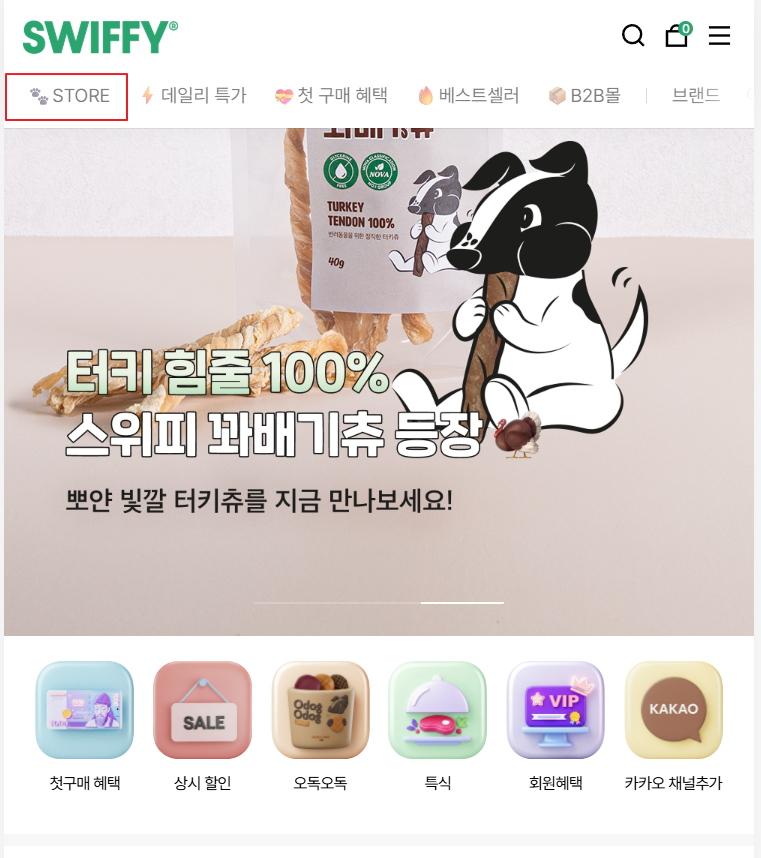
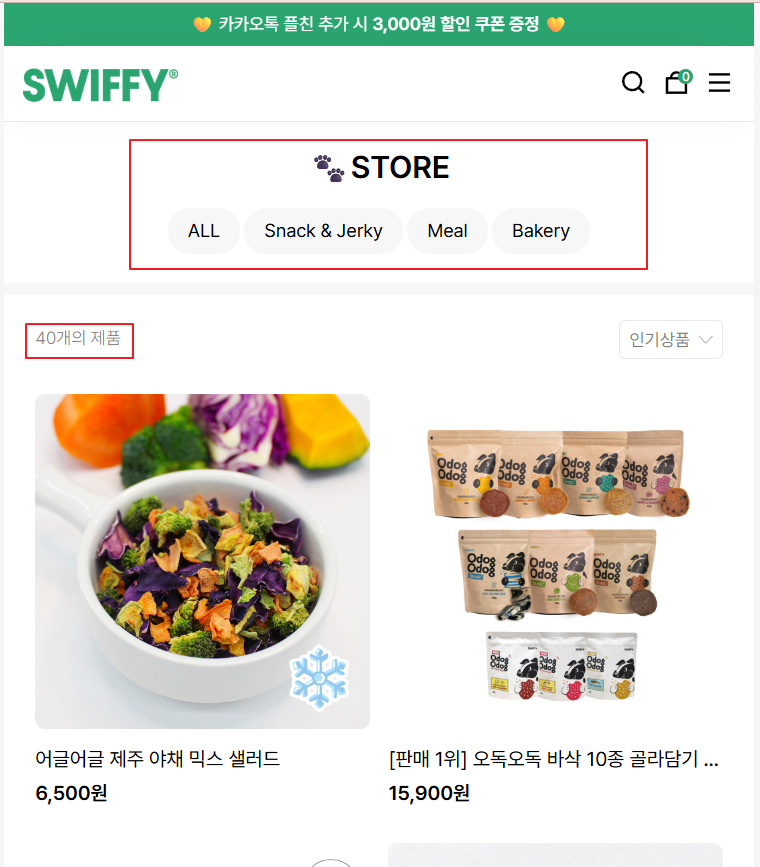
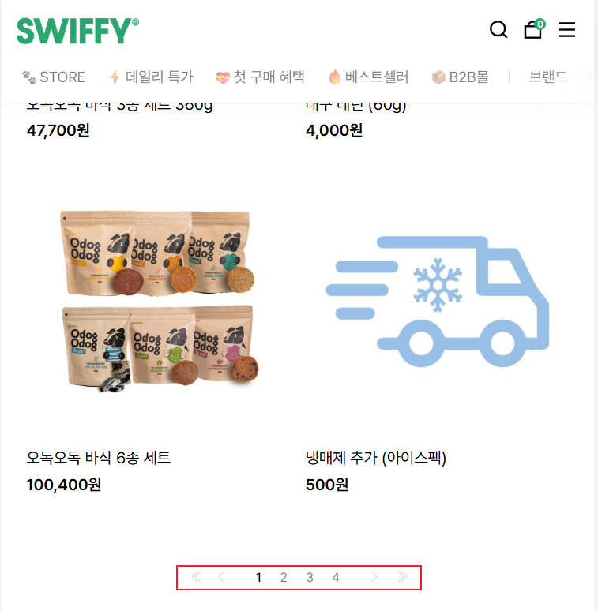
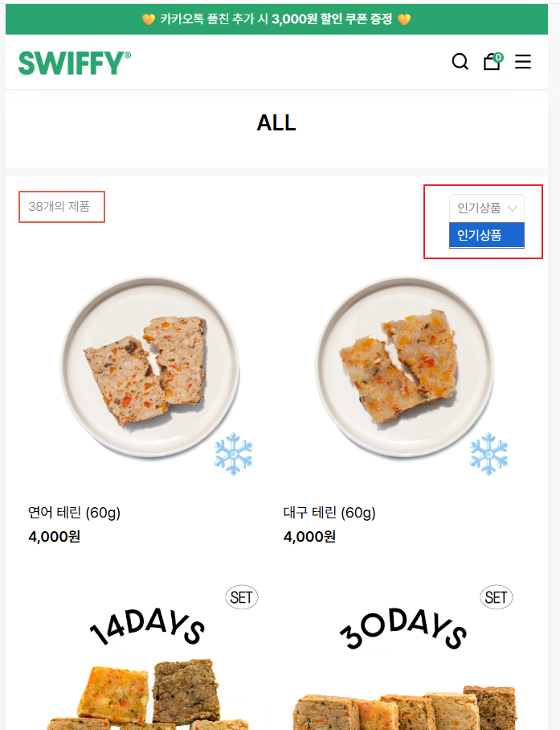
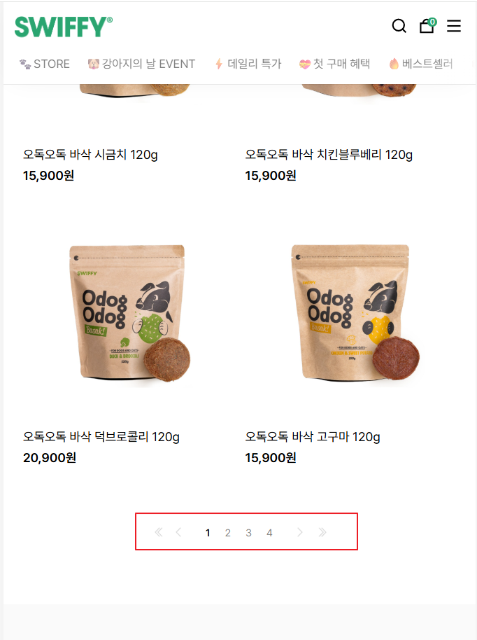


## 엔드 포인트 : api/v1/category/all

메인

```json
{
  "status": "success",
  "data": {
    "id": 1,
    "제품 총 개수": "",
    "ImageUrl": "",
    "title": "",
    "price" : ,
    "제품 들어갔을 때 Url"
  }
}
```


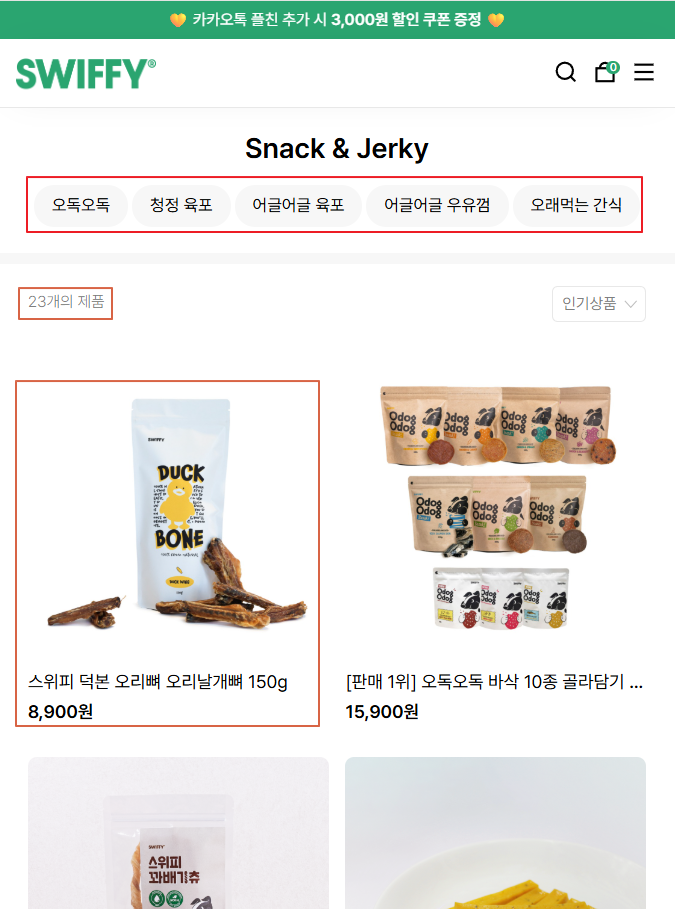


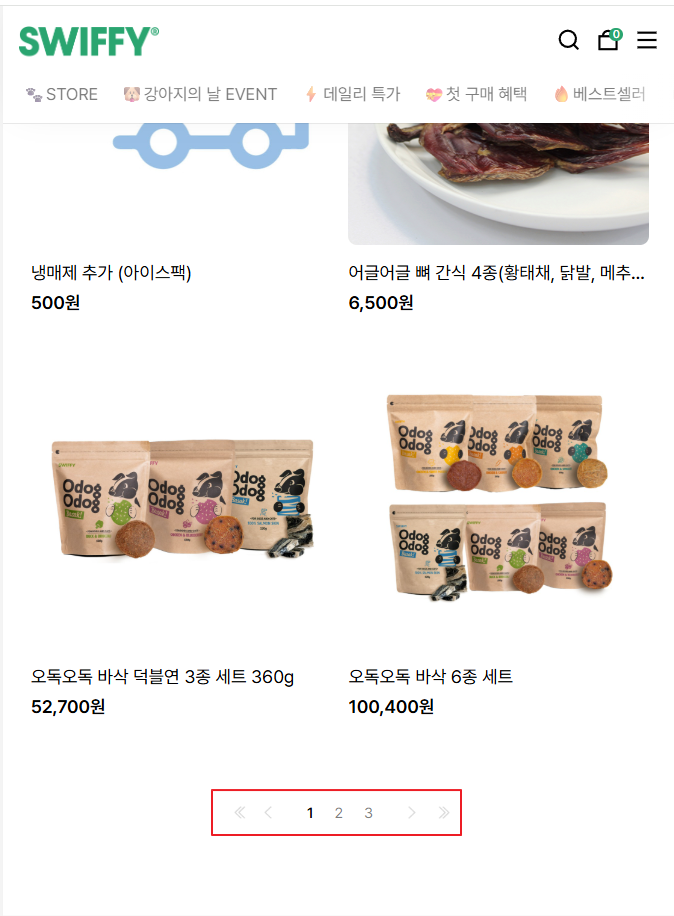
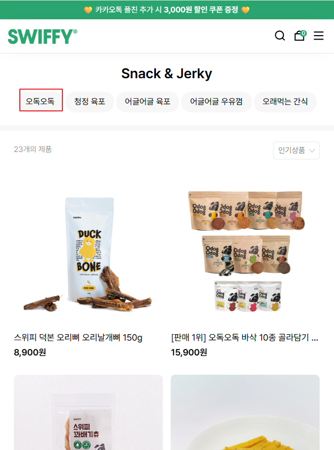
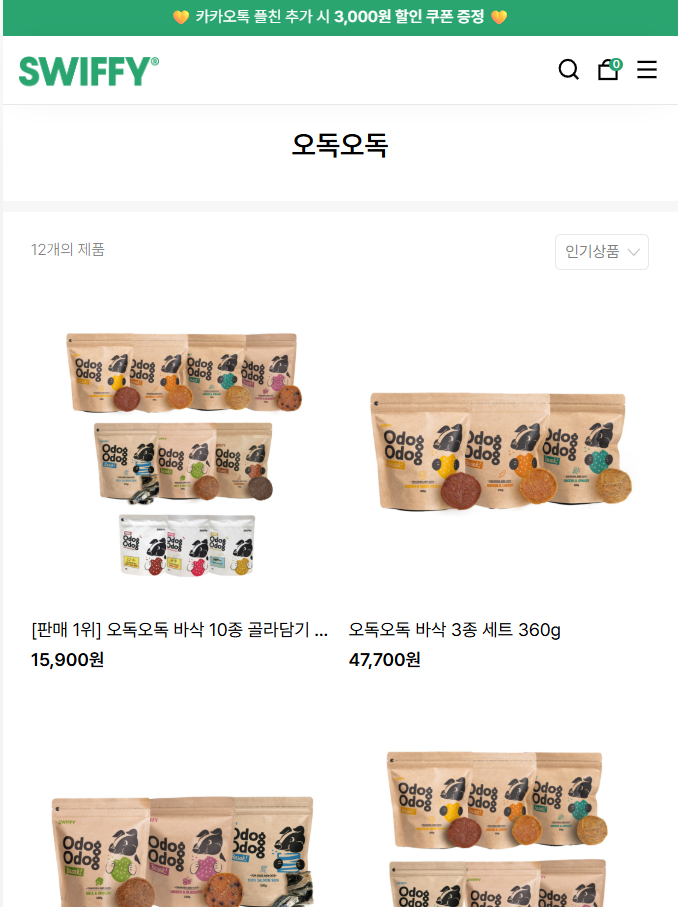
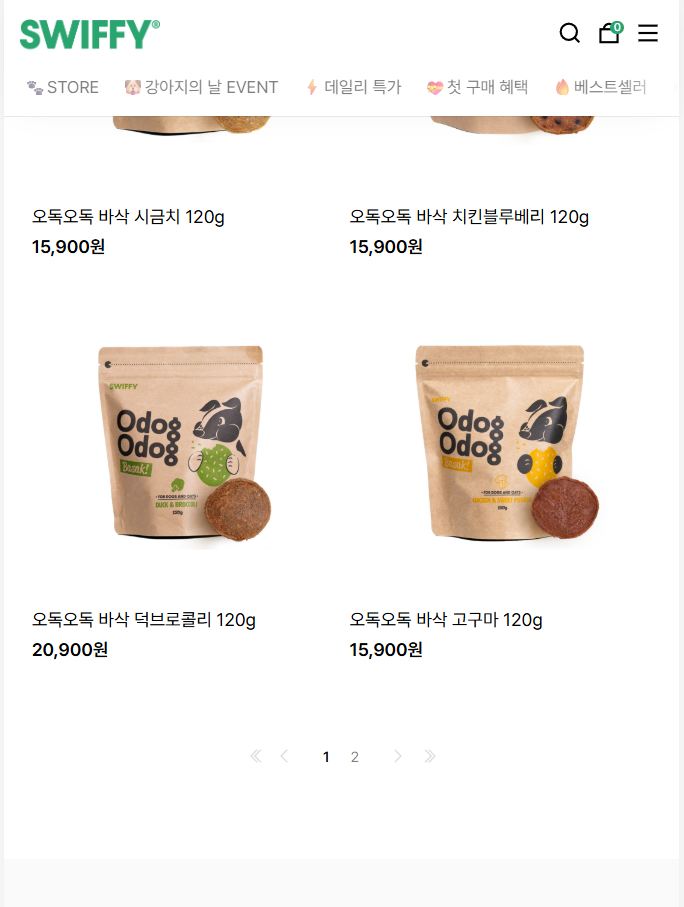

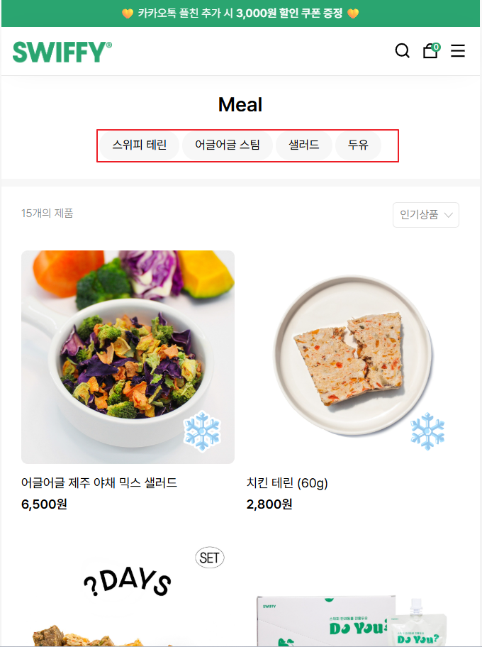
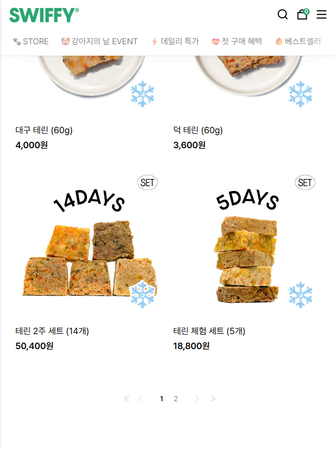

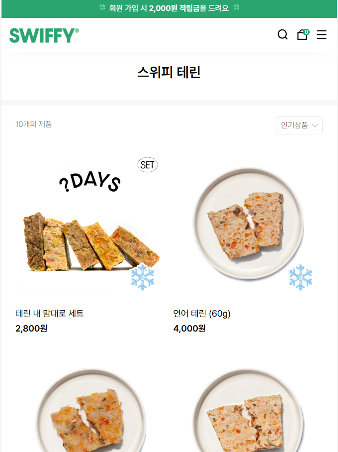
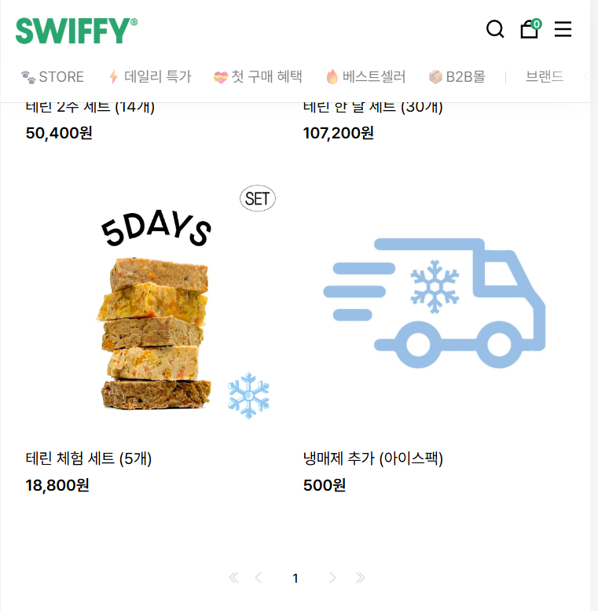

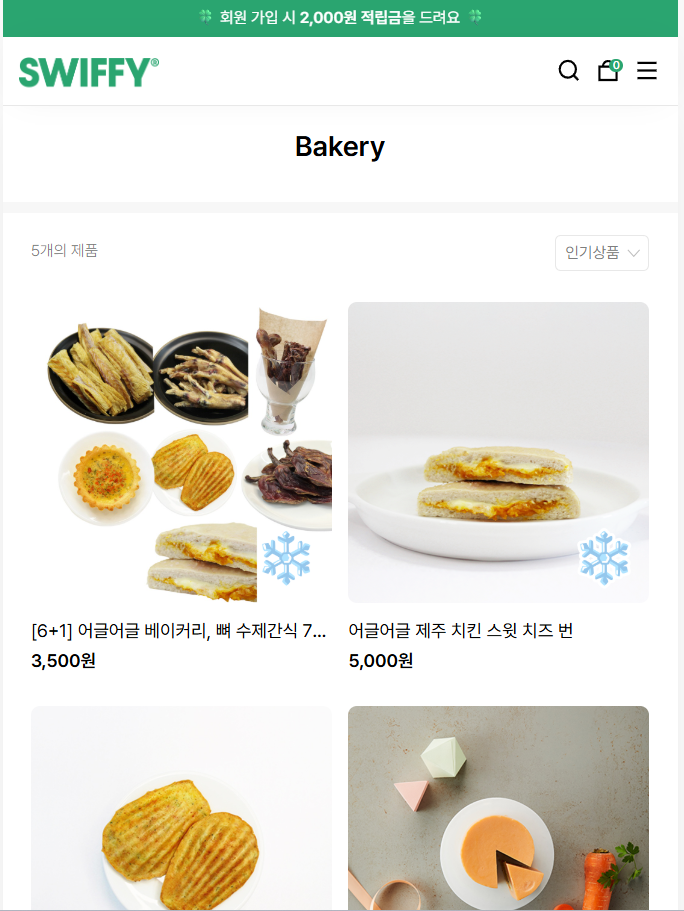
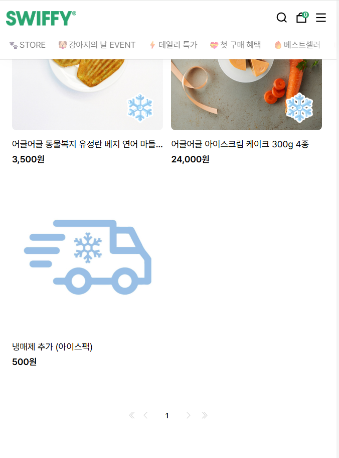


## 엔드 포인트 : api/v1/category/{categoryName}/{subcategoryName}

시리즈 카테고리
```json
{
  "status": "success",
  "data": {
    "id": 1,
    "시리즈카테고리": "",
    "title": "",
    "price" : ,
    "페이지 정보" : ,
    "제품 들어갔을 때 Url" : ""
  }
}
```

## 참고 사항

* 백엔드
1. 큰 카테고리는 4개
2. 작은 카테고리는 제품시리즈
3. Snack&Jerky에 있는 오래씹는 간식은 기타로 변경
4. 제품의 기본 정렬은 디폴트값 = 최신순 [최신순, 판매량순, 가격 높은순]
5. 메타데이터도 같이 제공
6. 제품의 정보는 10개씩 던져준다.
7. 대용량할인 카테고리를 빼고 아이템 옵션기능을 넣어서 할인기능을 넣습니다. ex) 슬렉 전체체널 쿠팡 사진
8. 정기배송시 사이트와 동일하게 할인
9. 함께 구매하면 좋은 제품의 기준을 "사용자들이 이 제품을 살 때 이 제품을 많이 사더라" 라는 것으로 정리 디폴트값은 추후 정리
10. 데일리특가가 정기배송으로 변경
11. 샐러드 두유를 삭제 or 이름변경


